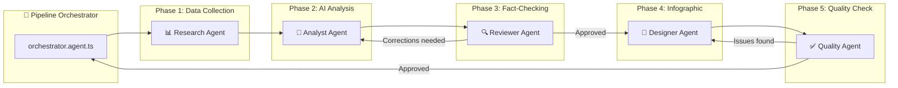
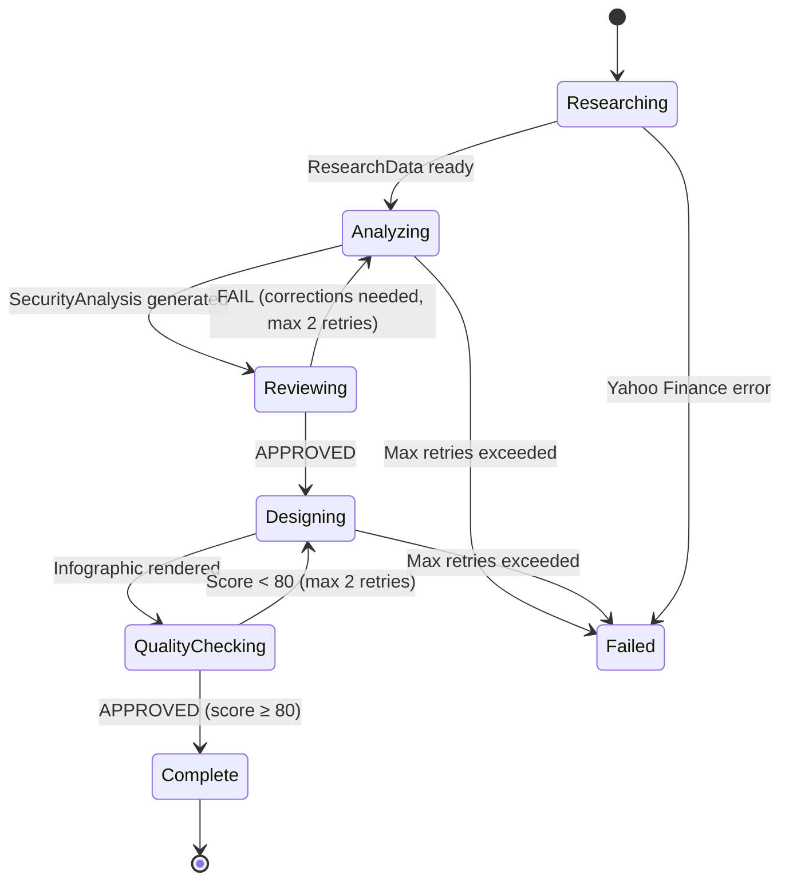

# AutoSWOT — Multi-Agent Architecture

## Overview

AutoSWOT uses an **Orchestrator-Worker** multi-agent pipeline where a central orchestrator delegates tasks to 5 specialized agents. Each agent has a clear role, structured I/O contracts (Zod schemas), and communicates via typed JSON payloads.

---

## Agent Definitions

### 1. 🎯 Pipeline Orchestrator

| Property | Value |
|---|---|
| **File** | `src/backend/agents/orchestrator.agent.ts` |
| **Model** | Gemini 2.5 Flash (routing only, low cost) |
| **Role** | Manages pipeline state, delegates to workers, handles retries and errors |

**Responsibilities:**
- Receives the user's ticker input and selected design style
- Executes the agent pipeline in sequence: Research → Analyst → Reviewer → Designer → Quality
- Manages retry loops (Reviewer ↔ Analyst, Quality ↔ Designer) with a max of 2 iterations each
- Aggregates final output (analysis + infographic) and returns to the API layer
- Tracks pipeline state with timestamps and status per phase

**Input:** `{ ticker: string, style: 'dark_gradient' | 'clean_corporate' | 'bold_editorial' }`
**Output:** `{ analysis: SecurityAnalysis, infographicPath: string, pipelineLog: PipelineStep[] }`

---

### 2. 📊 Research Agent

| Property | Value |
|---|---|
| **File** | `src/backend/agents/research.agent.ts` |
| **Model** | None (pure data fetching, no LLM) |
| **Skills** | `fetch_yahoo_finance`, `fetch_company_profile` |

**Responsibilities:**
- Fetches real financial data from Yahoo Finance (`yahoo-finance2` package)
- Retrieves: market cap, P/E, revenue, EPS, sector, industry, company description, historical prices
- Fetches income statement for revenue segment breakdown
- Returns a structured `ResearchData` payload with all raw financial facts
- This data is used by the Reviewer Agent to fact-check Gemini's analysis

**Input:** `{ ticker: string }`
**Output:** `ResearchData` — raw financial metrics, company profile, revenue figures

---

### 3. 🧠 Analyst Agent

| Property | Value |
|---|---|
| **File** | `src/backend/agents/analyst.agent.ts` |
| **Model** | Gemini 2.5 Flash |
| **Skills** | `generate_swot_analysis` |

**Responsibilities:**
- Receives the Research Agent's raw data as grounding context
- Sends a structured prompt to Gemini requesting:
  - Company overview (2-3 sentences)
  - Historical milestones (5-7 key events with years)
  - Revenue model explanation (how the company makes money, segment breakdown)
  - SWOT analysis (3-4 bullet points per quadrant)
- Uses Gemini's **structured JSON output** with a Zod schema to enforce response shape
- Enables **Google Search grounding** for up-to-date information
- If the Reviewer rejects the output, receives correction notes and regenerates

**Input:** `{ ticker: string, researchData: ResearchData, corrections?: ReviewerCorrections }`
**Output:** `SecurityAnalysis` — the full structured analysis

---

### 4. 🔍 Reviewer Agent

| Property | Value |
|---|---|
| **File** | `src/backend/agents/reviewer.agent.ts` |
| **Model** | Gemini 2.5 Flash |
| **Skills** | `validate_analysis`, `cross_reference_data` |

**Responsibilities:**
- Receives the Analyst's `SecurityAnalysis` AND the Research Agent's `ResearchData`
- Cross-references Gemini's claims against Yahoo Finance facts:
  - Are revenue figures within ±15% of actual data?
  - Is the sector/industry classification correct?
  - Are historical dates accurate (IPO year, founding year)?
  - Is the market cap range reasonable?
- Produces a structured review with per-field verdicts: `PASS`, `WARN`, or `FAIL`
- If any field is `FAIL`, returns correction notes back to the Analyst Agent for a retry
- If all fields pass (or only `WARN`), marks the analysis as `APPROVED`

**Input:** `{ analysis: SecurityAnalysis, researchData: ResearchData }`
**Output:** `ReviewResult` — `{ approved: boolean, verdicts: FieldVerdict[], corrections?: string }`

---

### 5. 🎨 Designer Agent

| Property | Value |
|---|---|
| **File** | `src/backend/agents/designer.agent.ts` |
| **Model** | Gemini 2.5 Flash (for layout decisions) |
| **Skills** | `generate_infographic`, `apply_design_style` |

**Responsibilities:**
- Receives the approved `SecurityAnalysis` and the user's chosen design style
- Uses Gemini to decide optimal content placement:
  - Which milestones to highlight (if >7, selects most impactful)
  - How to abbreviate long text for infographic space constraints
  - Color accents based on sector (tech=blue, finance=green, health=red, etc.)
- Renders the infographic using the Canvas engine (1080×1920):
  - Applies the selected style template (dark gradient / clean corporate / bold editorial)
  - Generates both JPEG and PNG exports
- If the Quality Agent rejects, receives notes and re-renders

**Input:** `{ analysis: SecurityAnalysis, style: DesignStyle, qualityNotes?: string }`
**Output:** `{ jpegPath: string, pngPath: string, layoutMeta: LayoutMetadata }`

---

### 6. ✅ Quality Agent

| Property | Value |
|---|---|
| **File** | `src/backend/agents/quality.agent.ts` |
| **Model** | Gemini 2.5 Flash (with vision) |
| **Skills** | `validate_infographic` |

**Responsibilities:**
- Receives the generated infographic image
- Uses Gemini's **multimodal vision** capabilities to analyze the rendered image:
  - Is all text readable (no truncation, no overlap)?
  - Are all SWOT quadrants populated?
  - Is the color contrast sufficient for accessibility?
  - Does the layout look professional and balanced?
- Produces a structured quality report with a score (0-100)
- If score < 80 or critical issues found, returns notes to Designer Agent for re-render
- If score ≥ 80, marks as `APPROVED`

**Input:** `{ imagePath: string, analysis: SecurityAnalysis }`
**Output:** `QualityResult` — `{ approved: boolean, score: number, issues: QualityIssue[] }`

---

## Pipeline State Machine

---

## Shared Types

All agents communicate via Zod-validated typed payloads defined in:
- `src/backend/agents/types/pipeline.types.ts` — Pipeline state, step logs
- `src/backend/agents/types/research.types.ts` — Yahoo Finance data shapes
- `src/backend/agents/types/analysis.types.ts` — SecurityAnalysis, SWOT
- `src/backend/agents/types/review.types.ts` — Review verdicts, corrections
- `src/backend/agents/types/design.types.ts` — Layout metadata, style config
- `src/backend/agents/types/quality.types.ts` — Quality scores, issues

---

## Error Handling & Observability

- Each agent emits structured logs with: `agentName`, `phase`, `duration`, `status`
- Pipeline orchestrator maintains a `PipelineStep[]` log returned to the frontend
- The frontend displays a step-by-step progress indicator showing which agent is active
- Failed pipelines return partial results when possible (e.g., analysis without infographic)
