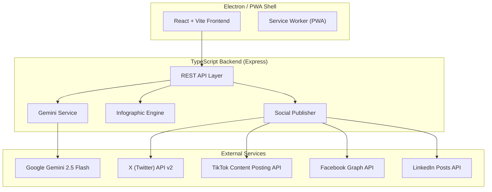
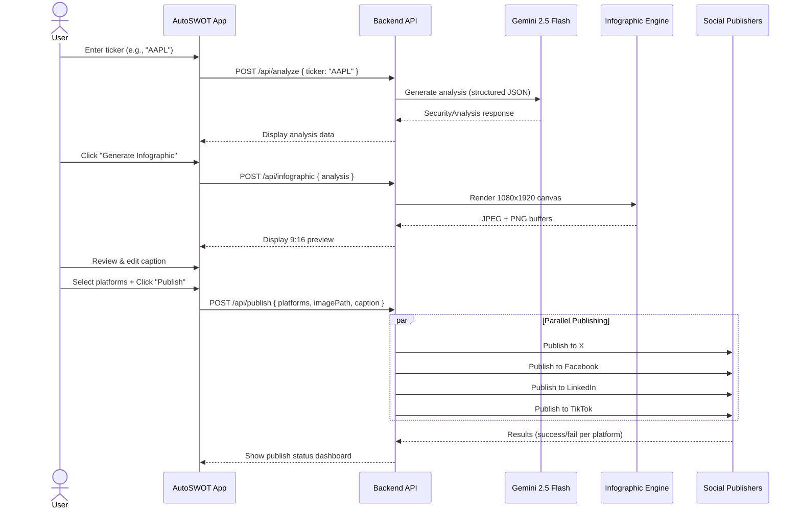

# AutoSWOT — Security Analysis & Social Publishing Platform

Generate AI-powered SWOT infographics for any financial security and publish them across social media — all from a sleek desktop/PWA app.

---

## Architecture Overview



---

## Tech Stack Rationale

### Backend: **TypeScript (Node.js)** ✅

| Criterion | TypeScript/Node | Rust | Go | Elixir |
|---|---|---|---|---|
| Gemini SDK | ✅ Official `@google/genai` | ⚠️ Community | ⚠️ Community | ❌ None |
| Social Media SDKs | ✅ `twitter-api-v2`, `axios` | ❌ Minimal | ⚠️ Limited | ❌ None |
| Canvas/Image Gen | ✅ `canvas`, `sharp` | ⚠️ Complex | ⚠️ Limited | ❌ None |
| Electron Integration | ✅ Same language | ❌ FFI | ❌ FFI | ❌ FFI |
| Type Safety | ✅ Full | ✅ Full | ✅ Partial | ⚠️ Dynamic |
| Dev Velocity | ✅ Fast | ⚠️ Slow | ✅ Moderate | ✅ Moderate |

**TypeScript wins** because the entire stack (Electron + backend + infographic engine) shares one language, the Gemini SDK is official and first-class, and the social media library ecosystem is the strongest.

### Frontend: **React + Vite**
- Vite for fast HMR and builds
- React for component-based UI
- Shared TypeScript across the entire stack

### Desktop/PWA: **Electron + electron-builder**
- Service Worker for offline PWA capabilities
- `electron-builder` for cross-platform packaging (Win/Mac/Linux)
- Web-first architecture: the app is a PWA that also runs inside Electron

---

## User Review Required

> [!IMPORTANT]
> **Social Media API Accounts Required.** You must create developer accounts and obtain API credentials for each platform before social publishing can work:
> - **X (Twitter)**: Developer account + pay-per-use billing (~$0.01/post)
> - **TikTok**: Developer app + manual review for `video.publish` scope
> - **Facebook**: Meta Developer app + Page Access Token with `pages_manage_posts`
> - **LinkedIn**: Developer app + `w_member_social` scope

> [!WARNING]
> **TikTok Photo/Carousel Limitation**: TikTok's Content Posting API supports photo uploads but requires **JPEG/WEBP format** (not PNG). The infographic engine will export in JPEG for TikTok compatibility. TikTok also requires a **manual app audit** before posting is enabled.

> [!IMPORTANT]
> **Unified API Alternative**: Instead of integrating 4 separate APIs, we could use a unified social media API service like **Ayrshare** or **Postproxy** — one SDK to post to all platforms. This would dramatically simplify the integration but adds a recurring cost (~$29-99/mo). **Do you prefer direct API integration or a unified service?**

---

## Open Questions

1. **Security data source**: Should we rely solely on Gemini's training knowledge for the company history/revenue model/SWOT, or should we also integrate a financial data API (like Yahoo Finance or Financial Modeling Prep) to ground the analysis with real numbers?

2. **Infographic design style**: Do you have a preferred visual style for the infographics? Options:
   - **Dark mode gradient** (deep navy/purple with vibrant accent colors)
   - **Clean corporate** (white background, structured grid layout)
   - **Bold editorial** (bright colors, large typography, magazine-style)

3. **Authentication**: Should the app support multiple user accounts (OAuth for each social platform), or is this a single-user tool with pre-configured API keys stored locally?

4. **History/Queue**: Should the app keep a history of generated infographics and allow re-publishing or scheduling?

---

## Proposed Changes

### Project Structure

```
autoswot/
├── package.json                  # Root: workspaces config
├── tsconfig.json                 # Shared TS config
├── .env.example                  # API keys template
│
├── src/
│   ├── backend/                  # Express + TypeScript backend
│   │   ├── server.ts             # Express entry point
│   │   ├── routes/
│   │   │   ├── analysis.ts       # POST /api/analyze - Gemini analysis
│   │   │   ├── infographic.ts    # POST /api/infographic - Generate image
│   │   │   └── publish.ts        # POST /api/publish - Social publishing
│   │   ├── services/
│   │   │   ├── gemini.service.ts          # Gemini API integration
│   │   │   ├── infographic.service.ts     # Canvas-based infographic engine
│   │   │   ├── social/
│   │   │   │   ├── x.publisher.ts         # X (Twitter) integration
│   │   │   │   ├── tiktok.publisher.ts    # TikTok integration
│   │   │   │   ├── facebook.publisher.ts  # Facebook integration
│   │   │   │   ├── linkedin.publisher.ts  # LinkedIn integration
│   │   │   │   └── publisher.interface.ts # Shared publisher contract
│   │   │   └── index.ts
│   │   ├── types/
│   │   │   ├── analysis.types.ts  # SWOT, revenue model, history types
│   │   │   └── publish.types.ts   # Social platform response types
│   │   └── config/
│   │       └── env.ts             # Environment config validation
│   │
│   ├── frontend/                  # React + Vite frontend
│   │   ├── index.html
│   │   ├── vite.config.ts
│   │   ├── public/
│   │   │   ├── manifest.json      # PWA manifest
│   │   │   └── sw.js              # Service Worker
│   │   ├── src/
│   │   │   ├── main.tsx           # React entry
│   │   │   ├── App.tsx            # Root component + routing
│   │   │   ├── index.css          # Design system + global styles
│   │   │   ├── pages/
│   │   │   │   ├── AnalyzePage.tsx     # Ticker input + analysis view
│   │   │   │   ├── InfographicPage.tsx # Preview + edit infographic
│   │   │   │   └── PublishPage.tsx     # Platform selector + publish
│   │   │   ├── components/
│   │   │   │   ├── TickerInput.tsx          # Autocomplete ticker search
│   │   │   │   ├── SwotCard.tsx             # Individual SWOT quadrant
│   │   │   │   ├── AnalysisDisplay.tsx      # Full analysis view
│   │   │   │   ├── InfographicPreview.tsx   # 9:16 canvas preview
│   │   │   │   ├── PlatformToggle.tsx       # Social platform selector
│   │   │   │   ├── PublishStatus.tsx        # Publishing progress/status
│   │   │   │   └── Navbar.tsx               # Navigation bar
│   │   │   └── hooks/
│   │   │       ├── useAnalysis.ts       # Analysis API hook
│   │   │       ├── useInfographic.ts    # Infographic generation hook
│   │   │       └── usePublish.ts        # Publishing hook
│   │   └── tsconfig.json
│   │
│   └── electron/                  # Electron main process
│       ├── main.ts                # Electron entry point
│       ├── preload.ts             # Context bridge
│       └── electron-builder.yml   # Build config
│
├── assets/
│   └── fonts/                     # Bundled fonts for infographic
│       ├── Inter-Bold.ttf
│       └── Inter-Regular.ttf
│
└── scripts/
    ├── dev.sh                     # Start dev (backend + frontend + electron)
    └── build.sh                   # Production build
```

---

### Component 1: Backend — Gemini Analysis Service

#### [NEW] [gemini.service.ts](file:///home/ggx/repos/autoswot/src/backend/services/gemini.service.ts)

Core Gemini integration using `@google/genai` SDK:
- **`analyzeSecuity(ticker: string)`**: Sends a structured prompt to Gemini 2.5 Flash asking for:
  1. **Company Overview** — Founded, headquarters, sector, market cap range
  2. **History** — Key milestones (founding, IPO, major acquisitions, pivots)
  3. **Revenue Model** — How the company makes money (segments, percentages)
  4. **SWOT Analysis** — Strengths, Weaknesses, Opportunities, Threats (3-4 bullet points each)
- Uses **structured JSON output** (Gemini's response schema) to enforce consistent data shape
- Google Search grounding enabled for real-time data accuracy

#### [NEW] [analysis.types.ts](file:///home/ggx/repos/autoswot/src/backend/types/analysis.types.ts)

```typescript
interface SecurityAnalysis {
  ticker: string;
  companyName: string;
  sector: string;
  overview: string;
  history: HistoryMilestone[];
  revenueModel: RevenueSegment[];
  swot: {
    strengths: string[];
    weaknesses: string[];
    opportunities: string[];
    threats: string[];
  };
  generatedAt: Date;
}
```

---

### Component 2: Infographic Engine

#### [NEW] [infographic.service.ts](file:///home/ggx/repos/autoswot/src/backend/services/infographic.service.ts)

Canvas-based (using `canvas` + `sharp`) infographic generator:
- **Dimensions**: 1080 × 1920px (9:16 portrait)
- **Layout sections** (top to bottom):
  1. **Header** — Company name, ticker, sector badge, logo placeholder
  2. **Overview** — Brief 2-3 sentence company summary
  3. **Timeline** — Visual horizontal timeline with key milestones
  4. **Revenue Breakdown** — Donut/pie chart showing revenue segments
  5. **SWOT Grid** — 2×2 grid with color-coded quadrants (Green/Red/Blue/Orange)
  6. **Footer** — Generation date, branding watermark
- Exports as **JPEG** (TikTok-compatible) and **PNG** (high quality for other platforms)
- Uses registered fonts (Inter) for professional typography
- Dark gradient background with glassmorphism card effects

---

### Component 3: Social Media Publishers

#### [NEW] [publisher.interface.ts](file:///home/ggx/repos/autoswot/src/backend/services/social/publisher.interface.ts)

```typescript
interface SocialPublisher {
  platform: 'x' | 'tiktok' | 'facebook' | 'linkedin';
  publish(imagePath: string, caption: string): Promise<PublishResult>;
  isConfigured(): boolean;
}
```

#### [NEW] [x.publisher.ts](file:///home/ggx/repos/autoswot/src/backend/services/social/x.publisher.ts)
- Uses `twitter-api-v2` library
- Two-step flow: upload media via v1.1 → post tweet via v2
- Includes image alt-text for accessibility

#### [NEW] [tiktok.publisher.ts](file:///home/ggx/repos/autoswot/src/backend/services/social/tiktok.publisher.ts)
- Uses TikTok Content Posting API via `axios`
- Async flow: initialize upload → poll for completion
- Exports infographic as JPEG/WEBP for compatibility

#### [NEW] [facebook.publisher.ts](file:///home/ggx/repos/autoswot/src/backend/services/social/facebook.publisher.ts)
- Uses Facebook Graph API v22.0 via `axios` + `form-data`
- Posts to configured Facebook Page
- Supports multipart form data upload

#### [NEW] [linkedin.publisher.ts](file:///home/ggx/repos/autoswot/src/backend/services/social/linkedin.publisher.ts)
- Uses LinkedIn Posts API (modern, replaces UGC Posts)
- Three-step: register upload → PUT binary → create post
- Handles API versioning headers

---

### Component 4: React Frontend

#### [NEW] [AnalyzePage.tsx](file:///home/ggx/repos/autoswot/src/frontend/src/pages/AnalyzePage.tsx)

The main entry screen:
- **Ticker Input** with autocomplete suggestions
- **"Analyze" button** triggers Gemini analysis
- Displays results in cards: Overview, Timeline, Revenue, SWOT grid
- Animated loading states with skeleton screens
- "Generate Infographic →" CTA button

#### [NEW] [InfographicPage.tsx](file:///home/ggx/repos/autoswot/src/frontend/src/pages/InfographicPage.tsx)

Infographic preview and editing:
- Full 9:16 preview rendered in a scrollable container
- Zoom controls and device frame mockup
- Caption editor for social media text
- "Publish →" CTA button

#### [NEW] [PublishPage.tsx](file:///home/ggx/repos/autoswot/src/frontend/src/pages/PublishPage.tsx)

Social media publishing dashboard:
- Toggle switches for each platform (X, TikTok, Facebook, LinkedIn)
- Shows connection status for each platform (configured/not configured)
- "Publish to Selected" button with confirmation modal
- Real-time progress indicators per platform
- Success/failure status with links to published posts

#### [NEW] [index.css](file:///home/ggx/repos/autoswot/src/frontend/src/index.css)

Design system:
- **Color palette**: Deep slate/indigo dark mode with vibrant teal/violet accents
- **Typography**: Inter (Google Fonts) + system fallbacks
- **Effects**: Glassmorphism cards, gradient borders, subtle shadows
- **Animations**: Page transitions, skeleton loading, pulse effects
- **Responsive**: Works in Electron window and browser PWA

---

### Component 5: Electron + PWA Shell

#### [NEW] [main.ts](file:///home/ggx/repos/autoswot/src/electron/main.ts)
- Creates `BrowserWindow` pointing to Vite dev server (dev) or built files (prod)
- Disabled `nodeIntegration`, enabled `contextIsolation` (security best practices)
- Custom title bar styling
- Window size: 440×900 (mobile-like for infographic preview)

#### [NEW] [manifest.json](file:///home/ggx/repos/autoswot/src/frontend/public/manifest.json)
- PWA manifest with app name, icons, theme colors
- `display: "standalone"` for app-like experience
- Start URL points to the analysis page

#### [NEW] [sw.js](file:///home/ggx/repos/autoswot/src/frontend/public/sw.js)
- Service Worker for offline caching of static assets
- Cache-first strategy for fonts and styles
- Network-first for API calls

---

### Component 6: Configuration & Build

#### [NEW] [package.json](file:///home/ggx/repos/autoswot/package.json)

Key dependencies:
```json
{
  "dependencies": {
    "@google/genai": "latest",
    "express": "^4.21",
    "canvas": "^2.11",
    "sharp": "^0.33",
    "twitter-api-v2": "^1.17",
    "axios": "^1.7",
    "form-data": "^4.0",
    "dotenv": "^16.4",
    "cors": "^2.8",
    "zod": "^3.23"
  },
  "devDependencies": {
    "typescript": "^5.5",
    "vite": "^6",
    "@vitejs/plugin-react": "^4",
    "react": "^19",
    "react-dom": "^19",
    "react-router-dom": "^7",
    "electron": "^33",
    "electron-builder": "^25",
    "tsx": "^4",
    "concurrently": "^9"
  }
}
```

#### [NEW] [.env.example](file:///home/ggx/repos/autoswot/.env.example)

```env
# Gemini
GEMINI_API_KEY=

# X (Twitter)
X_APP_KEY=
X_APP_SECRET=
X_ACCESS_TOKEN=
X_ACCESS_SECRET=

# TikTok
TIKTOK_CLIENT_KEY=
TIKTOK_CLIENT_SECRET=
TIKTOK_ACCESS_TOKEN=

# Facebook
FB_PAGE_ID=
FB_PAGE_ACCESS_TOKEN=

# LinkedIn
LINKEDIN_ACCESS_TOKEN=
LINKEDIN_PERSON_ID=
```

---

## User Flow



---

## Verification Plan

### Automated Tests

```bash
# 1. Build verification
npm run build          # Ensure TypeScript compiles cleanly

# 2. Unit tests
npm run test           # Jest tests for:
                       #   - Gemini service (mocked API responses)
                       #   - Infographic engine (canvas output dimensions)
                       #   - Publisher interfaces (mocked social APIs)

# 3. Dev server startup
npm run dev            # Verify frontend + backend start without errors
```

### Manual Verification

1. **Gemini Analysis**: Enter a well-known ticker (AAPL, MSFT) and verify the analysis is accurate, structured, and complete
2. **Infographic Output**: Verify the generated image is exactly 1080×1920, visually polished, and contains all sections
3. **PWA**: Open in Chrome, verify service worker registers and `manifest.json` is detected
4. **Electron**: Run `npm run electron:dev` and verify the desktop window opens with correct dimensions
5. **Social Publishing**: Test each platform individually with a test/draft post to verify image upload and caption work correctly

### Browser UI Testing
- Use the browser tool to navigate through all 3 pages (Analyze → Infographic → Publish)
- Verify responsive layout, animations, and loading states
- Test error states (invalid ticker, API failures)
