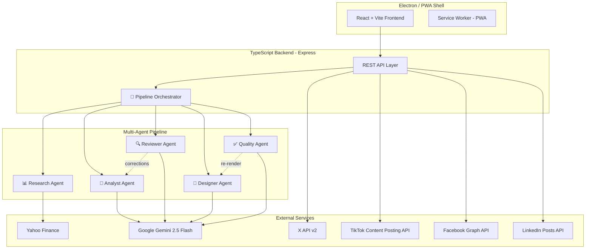
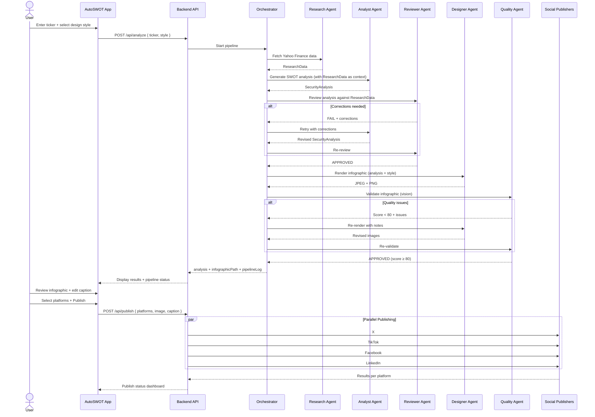

# AutoSWOT — Security Analysis & Social Publishing Platform

Generate AI-powered SWOT infographics for any financial security and publish them across social media — all from a sleek desktop/PWA app.

---

## Architecture Overview



---

## Decisions (Resolved)

| Question | Decision |
|---|---|
| Social media integration | **Direct API integration** — no unified service, no recurring cost |
| Data grounding | **Yahoo Finance** via `yahoo-finance2` — cross-check Gemini output against real data |
| Infographic design | **User chooses at runtime** — 3 styles: Dark Gradient, Clean Corporate, Bold Editorial |
| Authentication | **Single user** with local API keys + OAuth flows for social platforms |
| Multi-agent | **Yes** — Orchestrator-Worker pipeline for analysis review + infographic QA |

---

## Tech Stack

- **Backend**: TypeScript + Express + Node.js
- **Frontend**: React + Vite
- **AI**: Google Gemini 2.5 Flash (`@google/genai`)
- **Data**: Yahoo Finance (`yahoo-finance2`)
- **Infographic**: Canvas + Sharp (1080×1920 px, 9:16)
- **Desktop**: Electron + PWA Service Worker
- **Validation**: Zod schemas for all agent I/O
- **Social**: X API v2, TikTok Content Posting API, Facebook Graph API, LinkedIn Posts API

See [AGENTS.md](./AGENTS.md) for the full multi-agent architecture and [SKILLS.md](./SKILLS.md) for the skills registry.

---

## User Review Required

> [!IMPORTANT]
> **Social Media API Accounts Required.** You must create developer accounts and obtain API credentials for each platform:
> - **X (Twitter)**: Developer account + pay-per-use billing (~$0.01/post)
> - **TikTok**: Developer app + manual review for `video.publish` scope
> - **Facebook**: Meta Developer app + Page Access Token with `pages_manage_posts`
> - **LinkedIn**: Developer app + `w_member_social` scope

> [!WARNING]
> **TikTok Photo/Carousel**: Requires **JPEG/WEBP** (not PNG). The infographic engine exports JPEG for TikTok. TikTok also requires a **manual app audit** before posting is enabled.

---

## Project Structure

```
autoswot/
├── package.json
├── tsconfig.json
├── .env.example
├── AGENTS.md                          # Multi-agent architecture docs
├── SKILLS.md                          # Skills registry docs
│
├── src/
│   ├── backend/
│   │   ├── server.ts                  # Express entry point
│   │   ├── routes/
│   │   │   ├── analysis.ts            # POST /api/analyze
│   │   │   ├── infographic.ts         # POST /api/infographic
│   │   │   └── publish.ts             # POST /api/publish
│   │   │
│   │   ├── agents/                    # Multi-Agent System
│   │   │   ├── orchestrator.agent.ts  # 🎯 Pipeline orchestrator
│   │   │   ├── research.agent.ts      # 📊 Yahoo Finance data collection
│   │   │   ├── analyst.agent.ts       # 🧠 Gemini SWOT generation
│   │   │   ├── reviewer.agent.ts      # 🔍 Fact-checking against Yahoo data
│   │   │   ├── designer.agent.ts      # 🎨 Infographic rendering
│   │   │   ├── quality.agent.ts       # ✅ Vision-based QA
│   │   │   └── types/
│   │   │       ├── pipeline.types.ts
│   │   │       ├── research.types.ts
│   │   │       ├── analysis.types.ts
│   │   │       ├── review.types.ts
│   │   │       ├── design.types.ts
│   │   │       └── quality.types.ts
│   │   │
│   │   ├── skills/                    # Atomic agent capabilities
│   │   │   ├── registry.ts            # Skill registry
│   │   │   ├── skill.interface.ts     # Base Skill<TIn, TOut> interface
│   │   │   ├── research/
│   │   │   │   ├── fetch-yahoo-finance.skill.ts
│   │   │   │   └── fetch-company-profile.skill.ts
│   │   │   ├── analysis/
│   │   │   │   └── generate-swot.skill.ts
│   │   │   ├── review/
│   │   │   │   ├── validate-analysis.skill.ts
│   │   │   │   └── cross-reference.skill.ts
│   │   │   ├── design/
│   │   │   │   ├── generate-infographic.skill.ts
│   │   │   │   └── apply-style.skill.ts
│   │   │   └── quality/
│   │   │       └── validate-infographic.skill.ts
│   │   │
│   │   ├── services/
│   │   │   └── social/
│   │   │       ├── publisher.interface.ts
│   │   │       ├── x.publisher.ts
│   │   │       ├── tiktok.publisher.ts
│   │   │       ├── facebook.publisher.ts
│   │   │       └── linkedin.publisher.ts
│   │   │
│   │   └── config/
│   │       └── env.ts
│   │
│   ├── frontend/                      # React + Vite
│   │   ├── index.html
│   │   ├── vite.config.ts
│   │   ├── public/
│   │   │   ├── manifest.json
│   │   │   └── sw.js
│   │   └── src/
│   │       ├── main.tsx
│   │       ├── App.tsx
│   │       ├── index.css
│   │       ├── pages/
│   │       │   ├── AnalyzePage.tsx     # Ticker input + style selector + analysis
│   │       │   ├── InfographicPage.tsx # 9:16 preview + caption editor
│   │       │   └── PublishPage.tsx     # Platform toggles + publish status
│   │       ├── components/
│   │       │   ├── TickerInput.tsx
│   │       │   ├── StyleSelector.tsx   # 3-style visual picker
│   │       │   ├── SwotCard.tsx
│   │       │   ├── AnalysisDisplay.tsx
│   │       │   ├── PipelineProgress.tsx # Agent pipeline step indicator
│   │       │   ├── InfographicPreview.tsx
│   │       │   ├── PlatformToggle.tsx
│   │       │   ├── PublishStatus.tsx
│   │       │   └── Navbar.tsx
│   │       └── hooks/
│   │           ├── useAnalysis.ts
│   │           ├── useInfographic.ts
│   │           └── usePublish.ts
│   │
│   └── electron/
│       ├── main.ts
│       ├── preload.ts
│       └── electron-builder.yml
│
├── assets/
│   └── fonts/
│       ├── Inter-Bold.ttf
│       └── Inter-Regular.ttf
│
└── scripts/
    ├── dev.sh
    └── build.sh
```

---

## Component Details

### Component 1: Multi-Agent Pipeline

The core of the application. See [AGENTS.md](./AGENTS.md) for full architecture.

**Pipeline flow:** Research → Analyst → Reviewer (↔ retry) → Designer → Quality (↔ retry) → Done

**Key design decisions:**
- Max 2 retry loops between Reviewer ↔ Analyst and Quality ↔ Designer
- Research Agent is pure data (no LLM) — deterministic Yahoo Finance fetching
- Reviewer uses both deterministic comparison (cross-reference skill) AND Gemini for nuanced checks
- Quality Agent uses Gemini **multimodal vision** to inspect the rendered image
- All inter-agent payloads are Zod-validated

### Component 2: Social Media Publishers

Direct integration with each platform's native API:
- **X**: `twitter-api-v2` — media upload v1.1 → tweet v2
- **TikTok**: `axios` — async init → poll for completion
- **Facebook**: `axios` + `form-data` — Graph API v22.0 `/{page-id}/photos`
- **LinkedIn**: `axios` — register upload → PUT binary → create post

All implement a shared `SocialPublisher` interface for uniform error handling.

### Component 3: React Frontend

Three-page wizard flow:
1. **AnalyzePage** — Ticker input, **style selector** (3 visual cards to pick design style), analysis display with pipeline progress indicator
2. **InfographicPage** — 9:16 preview, caption editor, zoom controls
3. **PublishPage** — Platform toggles, connection status, publish with real-time progress

**New component: `StyleSelector.tsx`** — Visual card picker showing thumbnails of the 3 design styles. User selects before triggering analysis.

**New component: `PipelineProgress.tsx`** — Shows the multi-agent pipeline steps (Research → Analyze → Review → Design → QA) with active/complete/pending states.

### Component 4: Electron + PWA Shell

- Electron wraps the Vite frontend with `contextIsolation` enabled
- PWA manifest + Service Worker for browser-based offline support
- Window size: 440×900 (portrait, matches infographic ratio)

### Component 5: Configuration

Dependencies (added for multi-agent):
```json
{
  "dependencies": {
    "@google/genai": "latest",
    "yahoo-finance2": "^2.14",
    "express": "^4.21",
    "canvas": "^2.11",
    "sharp": "^0.33",
    "twitter-api-v2": "^1.17",
    "axios": "^1.7",
    "form-data": "^4.0",
    "dotenv": "^16.4",
    "cors": "^2.8",
    "zod": "^3.23"
  }
}
```

---

## User Flow



---

## Verification Plan

### Automated Tests

```bash
npm run build          # TypeScript compiles cleanly
npm run test           # Jest tests for:
                       #   - Each skill (mocked external calls)
                       #   - Agent pipeline (mocked Gemini + Yahoo Finance)
                       #   - Publisher interfaces (mocked social APIs)
                       #   - Infographic dimensions (1080x1920)
npm run dev            # Frontend + backend start without errors
```

### Manual Verification

1. **Pipeline**: Run analysis on AAPL — verify all 5 agents execute, pipeline log shows steps
2. **Reviewer**: Verify Gemini's analysis is cross-checked against Yahoo Finance data
3. **Infographic**: Verify 1080×1920 output in all 3 design styles
4. **Quality Agent**: Verify vision check catches truncated text or missing sections
5. **Social Publishing**: Test each platform individually with test/draft posts
6. **PWA**: Verify service worker registers in Chrome
7. **Electron**: Verify desktop window opens at 440×900

### Browser UI Testing

- Navigate all 3 pages (Analyze → Infographic → Publish)
- Verify style selector shows 3 visual options
- Verify pipeline progress indicator updates in real-time
- Test error states (invalid ticker, API failures, agent retries)
